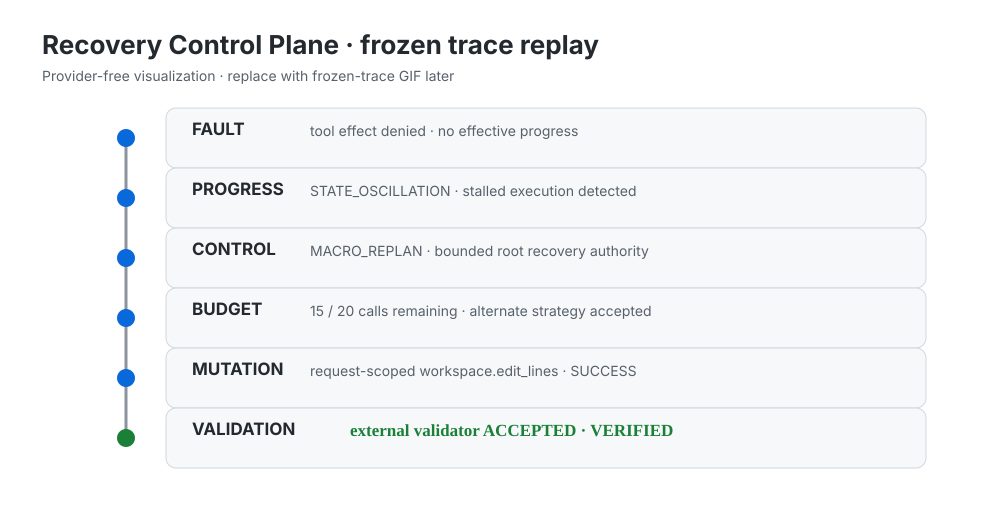
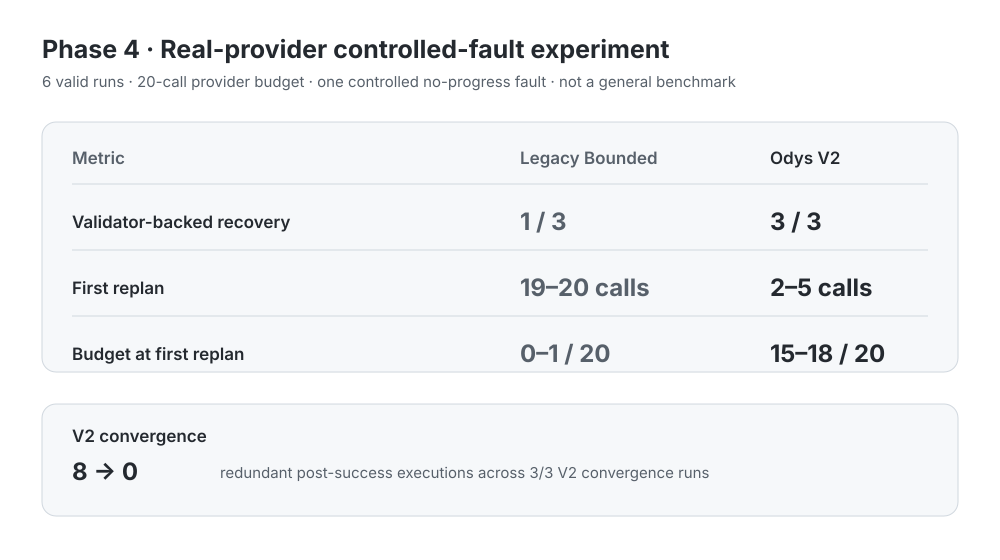
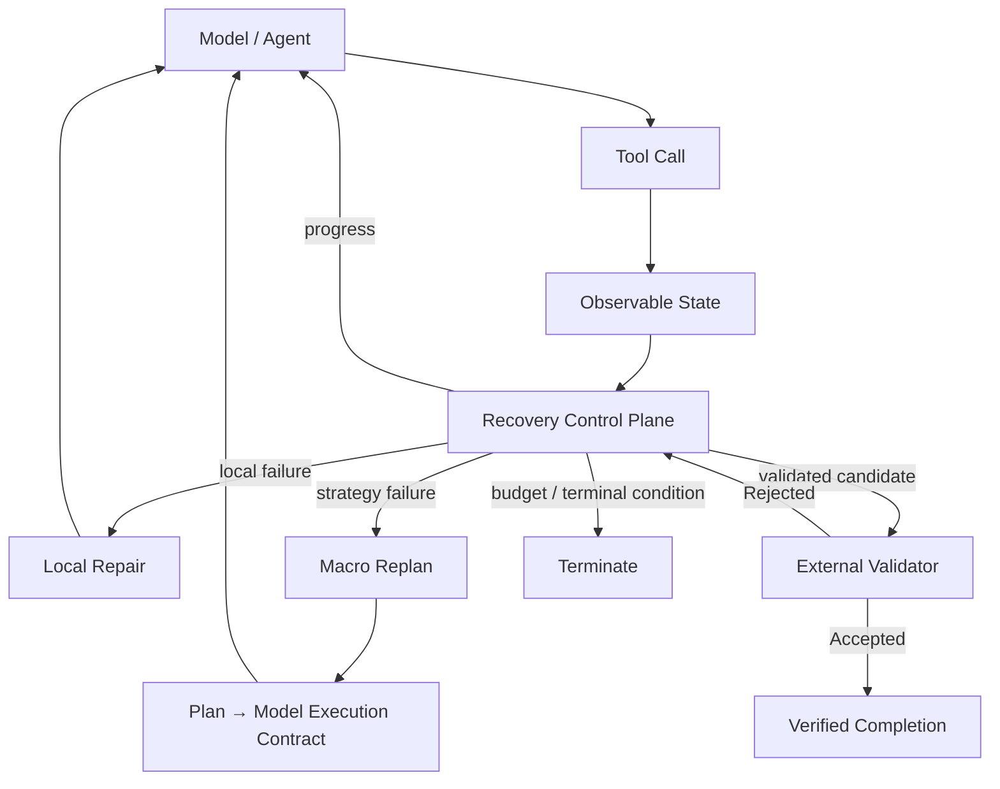

<p align="center">
  
</p>

<h1 align="center">Odys</h1>

<p align="center">
  <strong>Recovery Control Plane for Long-running AI Agents</strong>
</p>

<p align="center">
  Detect stalled execution, preserve recovery budget, replan safely, and verify completion against the real environment.
</p>

<p align="center">
  面向长任务 Agent 的恢复控制平面：在执行失败或持续无进展时进行有界恢复，并由外部环境验证最终完成状态。
</p>

<p align="center">
  <a href="https://github.com/Xixiartemis/Odys/actions">
    
  </a>
  
  
  
</p>

<p align="center">
  <a href="#-measured-recovery-results">Results</a> ·
  <a href="#-why-odys">Why Odys</a> ·
  <a href="#-recovery-control-plane">Recovery Control</a> ·
  <a href="#-evidence--reproducibility">Evidence</a> ·
  <a href="#-architecture">Architecture</a> ·
  <a href="#-quick-start">Quick Start</a> ·
  <a href="#-research-direction">Research</a> ·
  <a href="#-roadmap">Roadmap</a>
</p>

---

<!-- This SVG is a provider-free fallback. Replace with a frozen-trace GIF later. -->
<p align="center">
  
</p>

> **Tool Success ≠ Task Progress ≠ Verified Completion**

Odys 不把工具返回 `success`、模型声称 `done` 或一次 mutation 成功，直接当作任务完成。它负责在长时 Agent 的执行过程中识别停滞、保留恢复能力、接受受约束的重规划，并把最终完成权交给外部 Validator。

## 📊 Measured Recovery Results

以下是 **Phase 4 / Attempt6** 的 scoped real-provider controlled-fault experiment：6 次计划运行全部有效，使用同一模型/provider profile、受控 fault 和 **20-call provider budget**。它用于展示 Recovery Control Plane 的因果机制，不是 general benchmark，也不是跨任务、跨模型的泛化结论。

<p align="center">
  
</p>

| Metric | Legacy Bounded | Odys V2 |
|---|---:|---:|
| Validator-backed recovery | 1 / 3 | **3 / 3** |
| First replan | 19–20 calls | **2–5 calls** |
| Remaining budget at first replan | 0–1 / 20 | **15–18 / 20** |

For Odys V2, `15–18 / 20` means **75%–90%** of the root provider budget remained at first replan. The compact outcome summary is Legacy `1/3` versus V2 `3/3` validator-backed recovery.

> Phase 4 is a scoped real-provider controlled-fault experiment. It demonstrates the recovery mechanism, not broad task/model generalization.

Attempt6 的 provider-call observations were `20 / 20 / 20` for Legacy and `6 / 6 / 3` for V2. 由于 Legacy 与 V2 的 validator outcome 并不等价，不能把 aggregate provider-call/token difference 写成 same-quality cost saving。

### V2 convergence

After tightening the validation-candidate boundary, redundant executions after a successful post-replan mutation fell from **8 → 0 across 3/3 V2 convergence runs**.

这里的 **8 → 0**（compact label: `8→0`）是 Attempt5 → Attempt6 的 **V2 convergence behavior**，不是 `Legacy = 8` 对 `Odys = 0` 的 baseline comparison：Attempt5 的 V2 runs 在成功 post-replan mutation 后仍出现 8 次冗余执行；Attempt6 的 3/3 V2 runs 均为 exactly one successful post-replan mutation、zero redundant post-success executions。

### Causal chain

```text
controlled fault
      ↓
stalled / oscillating execution
      ↓
early recovery signal
      ↓
macro replan
      ↓
accepted strategy reaches actual model
      ↓
request-scoped tool authority
      ↓
real workspace mutation
      ↓
external validator
      ↓
validator-backed completion
```

## 🧭 Recovery Control Plane



四个核心机制：

- Tool success does not automatically mean task progress.
- Local repair and macro replan share bounded root recovery authority.
- Accepted replans must constrain the actual model-visible capability and tool arguments.
- Mutation or a model claim cannot directly create `VERIFIED`; completion requires external validation.

Odys 还记录 side-effect evidence，并在 commit state 不确定时 fail closed，而不是猜测已经成功。

## ✨ Why Odys

Long-running agents often fail in ways that ordinary retry logic cannot distinguish:

1. A tool reports success but the task does not progress.
2. Repeated recovery consumes the remaining model-call budget.
3. A new plan may be accepted but never reach the actual model/tool path.
4. A mutation may succeed without proving that the task is complete.
5. The model may claim completion before the environment satisfies acceptance criteria.

Odys treats these as runtime control problems, not as problems solved by a longer prompt alone.

```text
Tool Success
     ≠
Task Progress
     ≠
Verified Completion
```

## 🔬 Evidence & Reproducibility

结果不是人工截图，而是沿着可追溯链路关联：

```text
Commit SHA
  → Protocol Hash
  → Task Hash
  → Fault Hash
  → Raw Run
  → Execution Trace
  → External Validator
```

本次 README 使用的现有 machine-readable artifacts：

- [Attempt6 public summary](docs/evidence/phase4-attempt6/summary.json) — 6/6 valid, provider executed=true。
- [Attempt6 public experiment manifest](docs/evidence/phase4-attempt6/experiment-manifest.json) — protocol/task/fault/fixture/validator identity。
- [Attempt6 public evidence notes](docs/evidence/phase4-attempt6/README.md) — claim scope, convergence boundary, and sanitization notes。
- [Phase 4 evidence boundary](docs/evidence/phase4.md) — historical Attempt5 evidence boundary；不要把它当作 Attempt6 全部事实的替代品。
- [Evaluation protocol](docs/09_EVAL_PROTOCOL.md) — evaluation identity and reporting rules。
- [Phase 5 generalization plan](docs/phase5-benchmark-plan.md) — future cross-task/fault/model study。
- [Resume claim templates](docs/evidence/resume-claims.md) — conservative claim boundary。

> Phase 4 results report external validator-backed completion; durable finalization evidence is tracked separately in the Phase 4 evidence record.

## 🧱 Current / Measured

### Current

- Native Agent Kernel
- Durable Task / Run / Attempt
- Failure classification / provenance
- Recovery Control Plane
- Observable Progress
- Local Repair / Macro Replan
- Plan → Model Execution Contract
- Request-scoped Tool Authority
- External validation boundary
- Side-effect evidence / reconciliation
- Runtime Truth

### Measured

- Phase 4 controlled real-provider recovery experiment
- 6/6 valid runs
- V2: 3/3 validator-backed recovery
- Legacy: 1/3 validator-backed recovery
- Early replan with budget preservation
- V2 convergence: redundant post-success execution 8 → 0


## 🏗️ Architecture

Odys 的长期定义仍是 **Reliable & Efficient Long-Horizon Agent Runtime**；首页优先强调其中最有证据的 Recovery Control Plane。

```text
┌─────────────────────────────────────────────────────┐
│ Product Surfaces                                    │
│ CLI · API · TUI · future Web                       │
├─────────────────────────────────────────────────────┤
│ Capability Runtime                                  │
│ Tools · MCP · Skills · Retrieval · Memory          │
│ Browser · Search · Code · Shell · Sandbox          │
├─────────────────────────────────────────────────────┤
│ Native Minimal Agent Runtime                       │
│ Context → Model → Tool → Observation → State       │
├─────────────────────────────────────────────────────┤
│ Verified Workflow Runtime                           │
│ TaskGraph · Dependencies · Preconditions            │
│ Acceptance · Evidence · Repair · Replan            │
├─────────────────────────────────────────────────────┤
│ Adaptive Reliability Control Plane                  │
│ Task · Run · Attempt · CompletionAuthority          │
│ Validation · Failure · Recovery · Checkpoint        │
│ Runtime Truth · Liveness · Budget · Cost           │
└─────────────────────────────────────────────────────┘
```

### Native Agent Runtime

```text
Context → Model → Tool → Observation → State → next Model turn
```

模型保留 Tool-level micro-planning：读文件、搜索符号、修改代码、执行命令和阅读 traceback。Odys 拥有 macro planning：分解 verified outcome、管理依赖、恢复范围、验收和 replan。

### Verified Workflow Runtime

```text
PLANNED → READY → RUNNING → CLAIMED_COMPLETE → VERIFIED
```

`CLAIMED_COMPLETE` 不是权威状态；只有外部 acceptance evidence 可以产生 `VERIFIED`。失败沿着 failure provenance 进入 local repair、affected-subgraph repair，必要时才进入 macro replan。

### Reliability Control Plane

Odys 持久化并管理：

- **Task / Run / Attempt**：可恢复的执行 lineage。
- **CompletionAuthority / External Validator**：把 model claim 与完成授权分开。
- **Failure Provenance**：保留真实根因，避免把具体失败折叠成无关标签。
- **Observable Progress / Liveness**：区分业务进展与进程仍存在。
- **Recovery Budget**：限制模型轮次、工具调用和恢复成本。
- **Checkpoint / Resume / Runtime Truth**：保留执行状态，并区分 configured、effective、actual transport。

## 🔐 Runtime Truth and Verified Completion

```text
Configured Target
       ↓
Effective Target
       ↓
Actual Transport
```

如果 runtime 无法证明 actual transport 与 durable target 一致，应 fail closed，而不是猜测 provider、model 或成本归属。

## ♻️ Failure & Recovery Semantics

Failure 是一等 Runtime State，而不是普通的 retry hint：

```text
Executor Terminal Reason
        ↓
Attempt.error_type
        ↓
FailureReport
        ↓
RecoveryPolicy
        ↓
Recovery Action
```

具体失败保留在 `Failure Provenance` 中。例如 `BUDGET_EXHAUSTED` 不应在没有明确映射关系时被折叠成 `EMPTY_RESULT`；否则恢复策略、统计和 benchmark interpretation 都会失真。Recovery 通过 checkpoint/resume、local repair、affected-subgraph repair 和 macro replan 逐级扩大范围，并共享 bounded root recovery authority。

完成协议则是：

```text
Model claim
    ↓
Completion Candidate
    ↓
CompletionAuthority
    ↓
Authoritative External Validator
    ├── ACCEPTED → validator-backed completion
    └── REJECTED → failure classification + recovery
```

模型自己执行测试只能产生 execution evidence；Odys 的外部 Validator 产生 acceptance evidence。两者不能混为一谈。


## 🚀 Quick Start

### 环境要求

- Python 3.11+
- Git
- [`uv`](https://docs.astral.sh/uv/)

```bash
git clone https://github.com/Xixiartemis/Odys.git
cd Odys
uv sync --extra dev --extra live --extra agent
uv run pytest
uv run odys init-db
```

运行一个 Native Agent 任务：

```bash
uv run odys run \
  --repo /path/to/project \
  --kernel native \
  --verify "pytest -q" \
  "Fix the failing tests and verify the implementation."
```

检查持久化 Run：

```bash
uv run odys inspect <RUN_ID>
```

> Quick Start 只是运行入口；任务是否完成仍由 Odys 的外部 Validator 和 acceptance evidence 决定。

## 🧩 Capability Strategy

Odys 采用 **Reuse First**：复用成熟的 provider adapter、官方 MCP SDK、Skills、retrieval、memory、browser、sandbox 和 telemetry primitives；Odys 自己负责 execution lifecycle、verification、recovery 和 Runtime Truth。

| Capability | Direction |
|---|---|
| Model Provider | Provider adapter |
| MCP | Official MCP SDK behind an Odys adapter |
| Skills | Progressive `SKILL.md`-style capability loading |
| Retrieval / RAG | Pluggable retrieval infrastructure |
| Memory | Pluggable memory provider |
| Browser / Search | External automation/runtime adapter |
| Sandbox | External isolated execution backend |
| Telemetry | OpenTelemetry-compatible export |

## ⚙️ Adaptive Reliability

Odys 采用 **Minimum Sufficient Reliability**：不是机制越多越可靠，而是根据任务状态选择足够的控制强度。

| Level | Mode | Runtime contract |
|---:|---|---|
| 0 | **FAST** | Native Model/Tool Loop + Runtime Truth |
| 1 | **GUARDED** | FAST + CompletionAuthority + Validator |
| 2 | **DURABLE** | GUARDED + Workflow + Checkpoint + Recovery + Replan |
| 3 | **MULTI_AGENT** | DURABLE + Durable Delegation + Dependency Scheduling |

Browser、Search、Memory、Delegation 和更多 Provider 属于 capability expansion；它们不改变 Odys 对 execution semantics、verification 和 recovery 的拥有权。

## 💾 Durable State ≠ Prompt State

Durable State 可以包含 Task / Run / Attempt、Workflow State、Events、Validation Evidence、Failure Reports、Checkpoints、Memory 和 Artifacts。每次 model turn 只接收当前目标、相关 verified state/evidence、failure context 和当前允许的 capabilities。

```text
Durable State
      ↓
Context Selection
      ↓
Working Context
      ↓
Model
```

## 📈 Metrics and Engineering Method

核心指标是：

```text
Verified Completion Rate

Cost per Verified Completion
= 总执行成本 / 被 Validator 接受的任务数
```

同时关注 Model Turns、Tool Calls、Recovery Turns、Duplicate Side Effects、Lost Work After Failure、Stale Plan Execution、Human Intervention、Wall Time、Token Usage 和 Provider Cost。没有证据的指标保持 `NOT_MEASURED`，而不是估算。

Odys 使用实验驱动的工程流程：

```text
Reproducible Failure
        ↓
Baseline Evidence
        ↓
Mechanism Hypothesis
        ↓
Minimal Implementation
        ↓
Deterministic Regression
        ↓
Live Experiment
        ↓
Measured Result
```

> Green tests ≠ invariant proven；live task finished ≠ verified success。

## 🔭 Research Direction

Odys 正从 mechanism validation 走向 long-horizon agent recovery control 的 generalization study。

当前研究问题包括：

- When should a runtime continue, repair, replan, validate or terminate?
- Can observable progress preserve recovery capacity?
- How should recovery authority interact with tool side effects?
- How well do these mechanisms generalize across tasks, faults and models?

Phase 5 仍是 design / generalization work；见 [Phase 5 benchmark plan](docs/phase5-benchmark-plan.md)。这里不宣称 paper accepted、arXiv published 或 SOTA。

<details>
<summary>Evidence boundary & limitations</summary>

- Arbitrary long-horizon task generalization
- Cross-model generalization
- Public benchmark superiority
- Production readiness
- Arbitrary exactly-once external side effects
- Same-quality cost reduction when baseline and V2 have different validator outcomes

</details>

## 🗺️ Roadmap

### Completed / in progress

- **Phase 0 — Architecture Freeze**：runtime ownership、workflow semantics、reuse policy、adaptive reliability levels。
- **Phase 1 — Native Vertical Slice**：Model → Tool → Observation → Multiple Turns → CompletionAuthority → Validator。
- **Phase 2 — Minimum Capability Parity**：P0 read/write/edit/shell、官方 MCP adapter、selective context、cost accounting。
- **Phase 3 — Verified Workflow**：typed TaskGraph、dependencies、acceptance、evidence、selective repair、macro replan。
- **Phase 4 — Controlled Recovery Experiment**：fault-conditioned real-provider evidence and V2 convergence measurement。

### Future capability expansion

Browser、Search / Web、Memory、Delegation、更多 Provider 和 Sandbox backends 会根据 benchmark demand 逐步加入，不是当前首页的主要证据。

### Phase 5 and beyond

Phase 5 研究 adaptive reliability 和跨任务/跨 fault generalization；后续再考虑 productionization。详细路线见 [`docs/14_ROADMAP.md`](docs/14_ROADMAP.md)。

## 📁 Project Structure

```text
Odys/
├── src/lhas/              # Runtime implementation
├── tests/                 # Deterministic regression suite
├── docs/                  # Architecture / specifications / evidence
│   ├── adr/               # Architecture Decision Records
│   ├── assets/            # README presentation assets
│   └── evidence/          # Engineering evidence
├── experiments/           # Experimental records
├── results/               # Machine-readable result artifacts
├── benchmarks/            # Evaluation tasks
├── scripts/               # Validation / experiment tooling
└── AGENTS.md              # Coding-agent engineering policy
```

## 🧰 Development and Contribution

安装依赖并运行 deterministic suite：

```bash
uv sync --extra dev --extra live --extra agent
uv run pytest
uv run python -m pip check
```

修改核心架构前，请先阅读 [`docs/ARCHITECTURE_FREEZE.md`](docs/ARCHITECTURE_FREEZE.md)，提供可复现限制、证据、替代方案、迁移成本和 ADR。默认规则：**Extend, do not rewrite.**

核心文档：

- [`docs/01_ARCHITECTURE.md`](docs/01_ARCHITECTURE.md) — Runtime architecture
- [`docs/09_EVAL_PROTOCOL.md`](docs/09_EVAL_PROTOCOL.md) — Evaluation protocol
- [`docs/14_ROADMAP.md`](docs/14_ROADMAP.md) — Roadmap
- [`AGENTS.md`](AGENTS.md) — Coding-agent constraints
- [`THIRD_PARTY_NOTICES.md`](THIRD_PARTY_NOTICES.md) — Third-party notices

---

<p align="center">
  
</p>

<p align="center">
  <strong>让 Agent 不只是完成任务，而是能够证明它完成了。</strong>
</p>

<p align="center"><em>Build agents that can prove they finished.</em></p>
