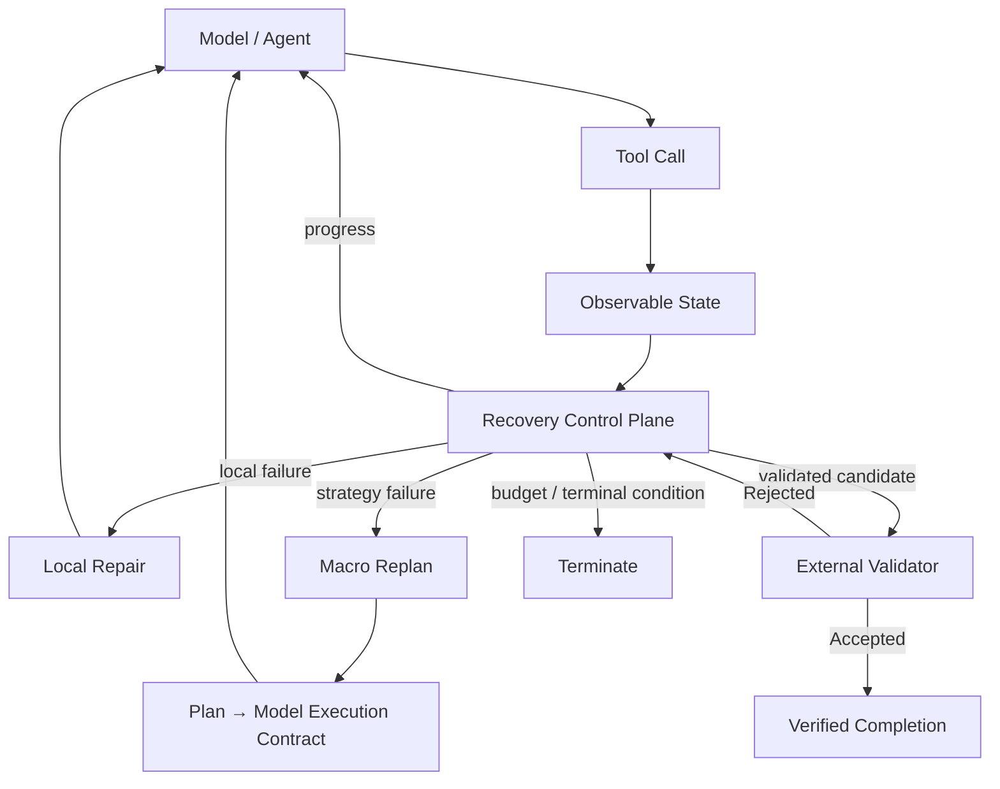
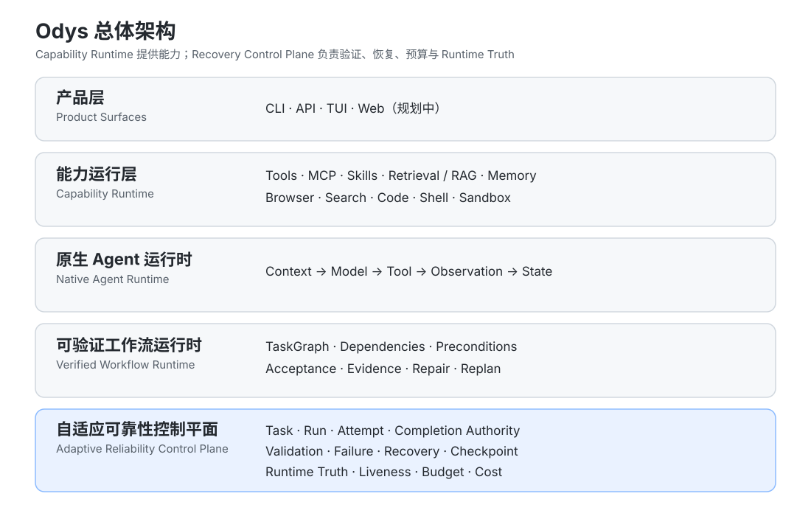

<p align="center">
  
</p>

<h1 align="center">Odys</h1>

<p align="center">
  <strong>面向长任务 AI Agent 的恢复控制平面</strong>
</p>

<p align="center">
  在执行失败或持续无进展时识别停滞、保留 Recovery Budget、安全重规划，并由真实环境验证任务是否真正完成。
</p>

<p align="center">
  <em>Recovery Control Plane for Long-running AI Agents</em>
</p>

<p align="center">
  <a href="https://github.com/Xixiartemis/Odys/actions">
    
  </a>
  
  
  
</p>

<p align="center">
  <a href="#-实测恢复结果">实验结果</a> ·
  <a href="#-为什么是-odys">为什么是 Odys</a> ·
  <a href="#-恢复控制平面-recovery-control-plane">恢复控制</a> ·
  <a href="#-证据与可复现性">证据</a> ·
  <a href="#-总体架构">总体架构</a> ·
  <a href="#-快速开始">快速开始</a> ·
  <a href="#-研究方向">研究方向</a> ·
  <a href="#-路线图">路线图</a>
</p>

---

<!-- This SVG is a provider-free fallback. Replace with a frozen-trace GIF later. -->
<p align="center">
  
</p>

> **Tool Success ≠ Task Progress ≠ Verified Completion**

Odys 不把工具返回 `success`、模型声称 `done` 或一次 mutation 成功，直接当作任务完成。它负责在长时 Agent 的执行过程中识别停滞、保留恢复能力、接受受约束的重规划，并把最终完成权交给外部 Validator。

## 📊 实测恢复结果

Phase 4 / Attempt6 是一个真实 Provider 受控故障对照实验（scoped real-provider controlled-fault experiment）。在相同模型、Provider、任务、故障、Validator 和 20-call budget 下，对 Legacy Bounded 与 Odys V2 进行受控对照。

<p align="center">
  
</p>

| 指标 | Legacy Bounded | Odys V2 |
|---|---:|---:|
| Validator-backed Recovery | 1 / 3 | **3 / 3** |
| 首次 Replan | 19–20 calls | **2–5 calls** |
| 首次 Replan 时剩余调用预算 | 0–1 / 20 | **15–18 / 20** |

Odys V2 在首次 Replan 时仍保留 15–18 / 20 的 root provider budget，即 75%–90%。简要结果是 Legacy 1/3、V2 3/3 的 validator-backed recovery。

> 这是 Phase 4 的受控故障机制实验结果，不代表跨任务、跨模型的通用性能结论。

Attempt6 的 provider-call observations 为 Legacy 20 / 20 / 20、V2 6 / 6 / 3。由于 Legacy 与 V2 的 validator outcome 并不等价，不能把 aggregate provider-call/token difference 写成 same-quality cost saving。

### V2 收敛结果

在收紧 validation-candidate boundary 后，3/3 V2 runs 中 successful post-replan mutation 之后的冗余执行从 **8 → 0**。

这里的 **8 → 0**（简写为 8→0）是 Attempt5 → Attempt6 的 **V2 convergence behavior**，不是 Legacy=8、Odys=0 的 baseline comparison：Attempt5 的 V2 runs 在成功 post-replan mutation 后仍出现 8 次冗余执行；Attempt6 的 3/3 V2 runs 均为 exactly one successful post-replan mutation、zero redundant post-success executions。

### 因果链路

```text
controlled fault
      ↓
stalled / oscillating execution
      ↓
early recovery signal
      ↓
macro replan
      ↓
accepted strategy reaches actual model
      ↓
request-scoped tool authority
      ↓
real workspace mutation
      ↓
external validator
      ↓
validator-backed completion
```

## 🧭 恢复控制平面（Recovery Control Plane）



四个核心机制：

- **Observable Progress**：Tool success 不自动等于任务推进。
- **Recovery Budget**：Local Repair 与 Macro Replan 共享受限的 root recovery authority。
- **Plan → Model Execution Contract**：接受后的新策略必须真实约束模型可见能力与工具参数。
- **External Validator**：Mutation 或模型 claim 都不能直接产生 VERIFIED。

Odys 还通过 **Side-effect Receipt** 记录副作用证据；对未知 commit state fail closed，而不是猜测已经成功。

## ✨ 为什么是 Odys

长任务 Agent 的失败不一定表现为显式异常。更常见的问题是：

1. 工具返回 success，但任务没有真实推进。
2. 重复修复持续消耗剩余调用预算。
3. 新计划虽然被接受，却没有真正约束 model → tool 执行链。
4. 一次 mutation 成功，不代表任务已经完成。
5. 模型声称 done，也不能代表真实环境满足验收条件。

Odys 将这些问题视为 Runtime Control 问题，而不是单纯依赖更长 Prompt 或更多 Retry。

```text
Tool Success
     ≠
Task Progress
     ≠
Verified Completion
```

## 🔎 证据与可复现性

结果不是人工截图，而是沿着可追溯的 artifact identity 链路关联：

```text
Commit SHA
  → Protocol Hash
  → Task Hash
  → Fault Hash
  → Raw Run
  → Execution Trace
  → External Validator
```

本次 README 使用的公开 machine-readable artifacts：

- [Attempt6 public summary](docs/evidence/phase4-attempt6/summary.json) — 6/6 valid，provider executed=true。
- [Attempt6 public experiment manifest](docs/evidence/phase4-attempt6/experiment-manifest.json) — protocol/task/fault/fixture/validator identity。
- [Attempt6 public evidence notes](docs/evidence/phase4-attempt6/README.md) — claim scope、convergence boundary 与 sanitization notes。
- [Phase 4 evidence boundary](docs/evidence/phase4.md) — historical Attempt5 evidence boundary；不要把它当作 Attempt6 全部事实的替代品。
- [Evaluation protocol](docs/09_EVAL_PROTOCOL.md) — evaluation identity 与 reporting rules。
- [Phase 5 generalization plan](docs/phase5-benchmark-plan.md) — future cross-task/fault/model study。
- [Resume claim templates](docs/evidence/resume-claims.md) — conservative claim boundary。

> Phase 4 结果报告 external validator-backed completion；durable finalization evidence 仍在 Phase 4 evidence record 中单独跟踪。

## 🧱 当前能力 / 已测量结果

### 当前能力

- Native Agent Kernel
- Durable Task / Run / Attempt
- Failure classification / provenance
- Recovery Control Plane
- Observable Progress
- Local Repair / Macro Replan
- Plan → Model Execution Contract
- Request-scoped Tool Authority
- External validation boundary
- Side-effect evidence / reconciliation
- Runtime Truth

### 已测量结果

- Phase 4 controlled real-provider recovery experiment
- 6/6 valid runs
- V2: 3/3 validator-backed recovery
- Legacy: 1/3 validator-backed recovery
- Early replan with budget preservation
- V2 convergence: redundant post-success execution 8 → 0


## 🏗️ 总体架构

Odys 的长期目标是构建一个 **可靠且高效的长任务 Agent Runtime**。当前首页优先展示其中实验依据最充分的 **Recovery Control Plane**。

<p align="center">
  
</p>

Odys 将“Agent 能做什么”和“Agent 如何可靠完成任务”分开：

- Capability Runtime 提供工具与外部能力。
- Native Runtime 承担 model ↔ tool 微观执行。
- Verified Workflow 维护任务级计划、依赖和验收。
- Recovery Control Plane 管理失败、恢复、预算和完成授权。

当前 Phase 4 的主要实验证据集中在最后一层。

### 原生 Agent 运行时

```text
Context → Model → Tool → Observation → State → next Model turn
```

模型保留 Tool-level micro-planning：读文件、搜索符号、修改代码、执行命令和阅读 traceback。Odys 拥有 macro planning：分解 verified outcome、管理依赖、恢复范围、验收和 replan。

### 可验证工作流运行时

```text
PLANNED → READY → RUNNING → CLAIMED_COMPLETE → VERIFIED
```

`CLAIMED_COMPLETE` 不是权威状态；只有外部 acceptance evidence 可以产生 `VERIFIED`。失败沿着 failure provenance 进入 local repair、affected-subgraph repair，必要时才进入 macro replan。

### Reliability Control Plane（可靠性控制平面）

Odys 持久化并管理：

- **Task / Run / Attempt**：可恢复的执行 lineage。
- **CompletionAuthority / External Validator**：把 model claim 与完成授权分开。
- **Failure Provenance**：保留真实根因，避免把具体失败折叠成无关标签。
- **Observable Progress / Liveness**：区分业务进展与进程仍存在。
- **Recovery Budget**：限制模型轮次、工具调用和恢复成本。
- **Checkpoint / Resume / Runtime Truth**：保留执行状态，并区分 configured、effective、actual transport。

## 🔐 Runtime Truth 与 Verified Completion

```text
Configured Target
       ↓
Effective Target
       ↓
Actual Transport
```

如果 runtime 无法证明 actual transport 与 durable target 一致，应 fail closed，而不是猜测 provider、model 或成本归属。

## ♻️ 失败与恢复语义

Failure 是一等 Runtime State，而不是普通的 retry hint：

```text
Executor Terminal Reason
        ↓
Attempt.error_type
        ↓
FailureReport
        ↓
RecoveryPolicy
        ↓
Recovery Action
```

具体失败保留在 `Failure Provenance` 中。例如 `BUDGET_EXHAUSTED` 不应在没有明确映射关系时被折叠成 `EMPTY_RESULT`；否则恢复策略、统计和 benchmark interpretation 都会失真。Recovery 通过 checkpoint/resume、local repair、affected-subgraph repair 和 macro replan 逐级扩大范围，并共享 bounded root recovery authority。

完成协议则是：

```text
Model claim
    ↓
Completion Candidate
    ↓
CompletionAuthority
    ↓
Authoritative External Validator
    ├── ACCEPTED → validator-backed completion
    └── REJECTED → failure classification + recovery
```

模型自己执行测试只能产生 execution evidence；Odys 的外部 Validator 产生 acceptance evidence。两者不能混为一谈。


## 🚀 快速开始

### 环境要求

- Python 3.11+
- Git
- [`uv`](https://docs.astral.sh/uv/)

```bash
git clone https://github.com/Xixiartemis/Odys.git
cd Odys
uv sync --extra dev --extra live --extra agent
uv run pytest
uv run odys init-db
```

运行一个 Native Agent 任务：

```bash
uv run odys run \
  --repo /path/to/project \
  --kernel native \
  --verify "pytest -q" \
  "Fix the failing tests and verify the implementation."
```

检查持久化 Run：

```bash
uv run odys inspect <RUN_ID>
```

> 快速开始只是运行入口；任务是否完成仍由 Odys 的外部 Validator 和 acceptance evidence 决定。

## 🧩 能力策略（Capability Strategy）

Odys 采用 **Reuse First**：复用成熟的 provider adapter、官方 MCP SDK、Skills、retrieval、memory、browser、sandbox 和 telemetry primitives；Odys 自己负责 execution lifecycle、verification、recovery 与 Runtime Truth。

| 能力 | 方向 |
|---|---|
| Model Provider | Provider adapter |
| MCP | Official MCP SDK behind an Odys adapter |
| Skills | Progressive `SKILL.md`-style capability loading |
| Retrieval / RAG | Pluggable retrieval infrastructure |
| Memory | Pluggable memory provider |
| Browser / Search | External automation/runtime adapter |
| Sandbox | External isolated execution backend |
| Telemetry | OpenTelemetry-compatible export |

## ⚙️ 自适应可靠性（Adaptive Reliability）

Odys 采用 **Minimum Sufficient Reliability**：不是机制越多越可靠，而是根据任务状态选择足够的控制强度。

| 等级 | 模式 | Runtime Contract |
|---:|---|---|
| 0 | **FAST** | Native Model/Tool Loop + Runtime Truth |
| 1 | **GUARDED** | FAST + CompletionAuthority + Validator |
| 2 | **DURABLE** | GUARDED + Workflow + Checkpoint + Recovery + Replan |
| 3 | **MULTI_AGENT** | DURABLE + Durable Delegation + Dependency Scheduling |

Browser、Search、Memory、Delegation 和更多 Provider 属于 capability expansion；它们不改变 Odys 对 execution semantics、verification 和 recovery 的拥有权。

## 💾 Durable State ≠ Prompt State

Durable State 可以包含 Task / Run / Attempt、Workflow State、Events、Validation Evidence、Failure Reports、Checkpoints、Memory 和 Artifacts。每次 model turn 只接收当前目标、相关 verified state/evidence、failure context 和当前允许的 capabilities。

```text
Durable State
      ↓
Context Selection
      ↓
Working Context
      ↓
Model
```

## 📈 指标与工程方法

核心指标是：

```text
Verified Completion Rate

Cost per Verified Completion
= 总执行成本 / 被 Validator 接受的任务数
```

同时关注 Model Turns、Tool Calls、Recovery Turns、Duplicate Side Effects、Lost Work After Failure、Stale Plan Execution、Human Intervention、Wall Time、Token Usage 和 Provider Cost。没有证据的指标保持 `NOT_MEASURED`，而不是估算。

Odys 使用实验驱动的工程流程：

```text
Reproducible Failure
        ↓
Baseline Evidence
        ↓
Mechanism Hypothesis
        ↓
Minimal Implementation
        ↓
Deterministic Regression
        ↓
Live Experiment
        ↓
Measured Result
```

> Green tests ≠ invariant proven；live task finished ≠ verified success。

## 🔭 研究方向

Odys 正从单一机制验证逐步进入 long-horizon agent recovery control 的泛化研究。

当前研究问题包括：

- Runtime 应在什么时候继续、局部修复、重规划、验证或终止？
- **Observable Progress** 能否更早识别无效执行并保留 **Recovery Budget**？
- Recovery authority 应如何与 tool side effects 协同？
- 这些机制能否跨任务、故障类型与模型泛化？

Phase 5 仍是 design / generalization work；见 [Phase 5 benchmark plan](docs/phase5-benchmark-plan.md)。这里不宣称 paper accepted、arXiv published 或 SOTA。

<details>
<summary>证据边界与限制</summary>

- Arbitrary long-horizon task generalization
- Cross-model generalization
- Public benchmark superiority
- Production readiness
- Arbitrary exactly-once external side effects
- Same-quality cost reduction when baseline and V2 have different validator outcomes

</details>

## 🗺️ 路线图

### 当前进展

- **Phase 0 — Architecture Freeze**：冻结 runtime ownership、workflow semantics、reuse policy 与 adaptive reliability levels。
- **Phase 1 — Native Vertical Slice**：完成 Model → Tool → Observation → Multiple Turns → CompletionAuthority → Validator 执行链。
- **Phase 2 — Minimum Capability Parity**：完成 P0 read/write/edit/shell、官方 MCP adapter、selective context 与 cost accounting。
- **Phase 3 — Verified Workflow**：typed TaskGraph、dependencies、acceptance、evidence、selective repair 与 Macro Replan。
- **Phase 4 — Controlled Recovery Experiment**：fault-conditioned real-provider evidence 与 V2 convergence measurement。

### 未来 capability expansion

Browser、Search / Web、Memory、Delegation、更多 Provider 和 Sandbox backends 会根据 benchmark demand 逐步加入，不是当前首页的主要证据。

### Phase 5 及后续

Phase 5 研究 adaptive reliability 和跨任务/跨 fault generalization；后续再考虑 productionization。详细路线见 [`docs/14_ROADMAP.md`](docs/14_ROADMAP.md)。

## 📁 项目结构

```text
Odys/
├── src/lhas/              # Runtime 实现
├── tests/                 # Deterministic regression suite
├── docs/                  # 架构、规范与证据
│   ├── adr/               # Architecture Decision Records
│   ├── assets/            # README presentation assets
│   └── evidence/          # Engineering evidence
├── experiments/           # 实验记录
├── results/               # Machine-readable result artifacts
├── benchmarks/            # Evaluation tasks
├── scripts/               # 验证与实验工具
└── AGENTS.md              # Coding-agent engineering policy
```

## 🧰 开发与贡献

安装依赖并运行 deterministic suite：

```bash
uv sync --extra dev --extra live --extra agent
uv run pytest
uv run python -m pip check
```

修改核心架构前，请先阅读 [`docs/ARCHITECTURE_FREEZE.md`](docs/ARCHITECTURE_FREEZE.md)，提供可复现限制、证据、替代方案、迁移成本和 ADR。默认规则：**Extend, do not rewrite.**

核心文档：

- [`docs/01_ARCHITECTURE.md`](docs/01_ARCHITECTURE.md) — Runtime architecture
- [`docs/09_EVAL_PROTOCOL.md`](docs/09_EVAL_PROTOCOL.md) — Evaluation protocol
- [`docs/14_ROADMAP.md`](docs/14_ROADMAP.md) — Roadmap
- [`AGENTS.md`](AGENTS.md) — Coding-agent constraints
- [`THIRD_PARTY_NOTICES.md`](THIRD_PARTY_NOTICES.md) — Third-party notices

---

<p align="center">
  
</p>

<p align="center">
  <strong>让 Agent 不只是完成任务，而是能够证明它完成了。</strong>
</p>

<p align="center"><em>Build agents that can prove they finished.</em></p>
